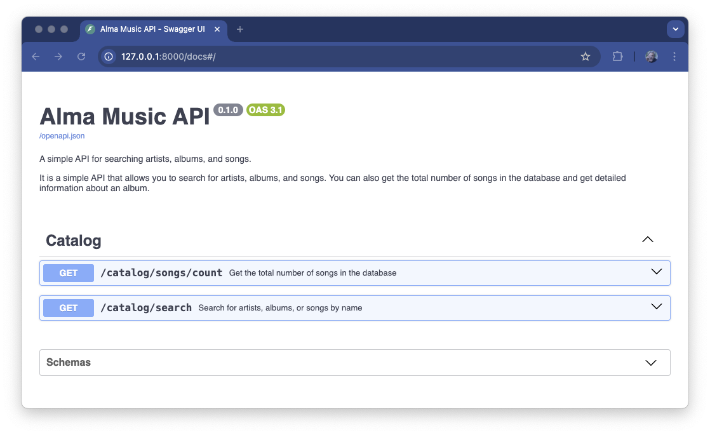
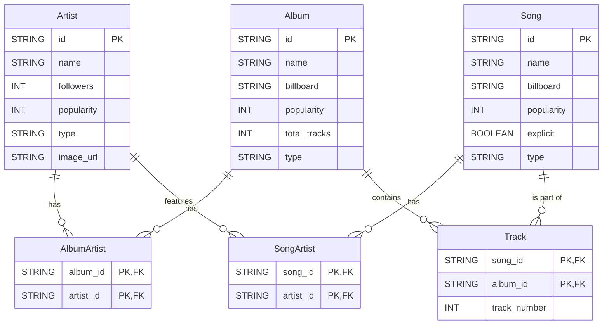

# Alma's Recruitment Test for Backend Candidates

## Introduction

This test is designed to assess your skills in backend development in Python.

You will be asked to implement a simple API that will serve information about music albums.
The API will be implemented using FastAPI, a modern Python web framework.


## Installation/Usage

```console
# Install poetry (brew, apt-get, …)
poetry install --no-root
poetry run fastapi dev
poetry run pytest
```

## Alma Music API

The API two endpoints:

| Method | URL Path                                    | Description                                             |
|--------|---------------------------------------------|---------------------------------------------------------|
| GET    | `/catalog/songs/count`                      | Returns the total number of songs in the catalog        |
| GET    | `/catalog/search?q={query}&entity={entity}` | Returns a list of songs and albums that match the query |




### DB Schema



## Remaining Tasks

- [ ] Add a test against `/catalog/search` to search for an `artist` named `hendrix` (expected 1 record)
- [ ] Implement a new endpoint `GET /catalog/albums/{album_id}` which makes the test `test_views.py::test_get_album` pass
- [ ] On the same endpoint, implement a text output when `Accept:text/plain` with the following Specs 1
- [ ] SREs reported that load balancer raises errors because the output of `/catalog/search` is too big; can you investigate and propose a fix?
- [ ] Provide a code review for current status of the API, and suggest improvements.

> [!NOTE]
> Feel free to open as many PRs as you want on your repository.
> We recommend **one per task** which you can merge into a branch to build steps on top of one another.
> For the last task, you can do it as a PR review which you keep open or add a new Markdown document which contains your remarks.

### Specs 1: GET /catalog/albums/{album_id} (plain text)

```
[Album name]

  [Track number]. [Track name]
  [Track number]. [Track name]
  [Track number]. [Track name]
  [Track number]. [Track name]

Total tracks: [total number of tracks]

```

`[Track number]` is on 3 chars, left-padded with spaces.


> [!WARNING]
> **Note:** on some albums, not all the songs are available, so it's normal to have
> only 4 songs for some albums.

#### Example

```console
http --body :8000/catalog/album/6i6folBtxKV28WX3msQ4FE Accept:text/plain
```
```
Bohemian Rhapsody (The Original Soundtrack)

    5. Killer Queen
    7. Bohemian Rhapsody
    9. Crazy Little Thing Called Love
   12. Another One Bites The Dust
   13. I Want To Break Free

Total tracks: 22
```
